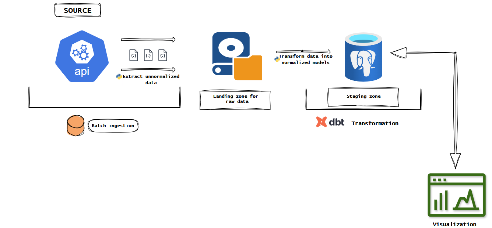

# ClinicalTrials.gov ELT Pipeline

*This is a locally managed ETL - ELT hybrid pipeline built with production principles as a guide: fault tolerance, and separation of concerns.*

The pipeline ingests clinical trial data from ClinicalTrials.gov API, stages it in PostgreSQL, and transforms it using dbt into a dimensional model for analytics.

*I hope you have fun going through it as much as I had building it.*

**Stack:** Python, PostgreSQL, dbt, Docker, lots of Coffee and Sugar.

## Architecture Overview


```

┌─────────────────────────────────────────────────────────┐
│                    EXTRACTION LAYER                     │
│  API -> Parquet Shards (crash-resilient, stateful)      │
│               Rate Limited: 50 req/min                  │
│                         
                       COMPACTION                         │
│        Parquet Shards -> Single Compacted File          
│           (Storage optimization for loading)            │
└─────────────────────────────────────────────────────────┘
                           |
                           V
┌─────────────────────────────────────────────────────────┐
│             TRANSFORMATION/LOADING LAYER                │
│    Parquet -> Pandas (flatten) -> Postgres Staging      │
│                 (Structured tables)                     │
└─────────────────────────────────────────────────────────┘
                           |
                           V
┌─────────────────────────────────────────────────────────┐
│             FINAL TRANSFORMATION LAYER                  │
│            dbt models: facts & dimensions               │
└─────────────────────────────────────────────────────────┘
```
## Why Hybrid ETL-ELT?

**Challenge:** ClinicalTrials.gov data has deeply nested JSON with no natural keys for dimensional entities (sponsors, interventions, sites). Once flattened, parent-child relationships are permanently lost.

**Solution:** 
- **Extract + Transform (Python):** Parse nested structures, generate surrogate keys, preserve relationships
- **Load (Postgres):** Store structured dimensional tables
- **Transform (dbt):** Business logic, aggregations, snapshots

**Why not pure ELT?** Loading raw nested JSON to Postgres and parsing in SQL would:
- Create unreadable dbt models with complex JSON path navigation
- Lose referential integrity (can't link studies to interventions after flattening)
- Perform poorly (SQL JSON parsing is slower than Python)

---

## Key Design Decisions
### Crash resistant extraction with State Persistence
ClinicalTrials.gov uses token-based pagination. You can't jump to a page without extracting the token from the previous page, and the same token always returns the same data

On restart after a crash, the program reads the last token and last loaded page, and resume extraction without re-calling previous API pages.

**Implementation:** 

- I Initialized the `Extractor` class with `last_saved_page`, `last_saved_token`, and `next_page_url`. 
- Then track and persist state in `states/last_extraction_result.py`, `states/last_shard_path.py`, and `states/last_token.py` after each API call.

File writes are unconventional, but I think it makes sense for a locally built and managed stack.

### Crash Recovery Flow

1. **On Start:** The script checks `extraction_result.py`
   - If the state of the last extraction is `SUCCESS`: Then it starts a fresh extraction (page 0)
   - `FAILURE` or `IN PROGRESS`: Resume from last saved page in current shard as the last extraction that ran was interrupted

2. **During Extraction:** 
   - Write `IN PROGRESS` status before each request
   - Save JSON data as a parquet file immediately after a successful API call
   - Update `last_token.py` with next page token

3. **On Completion:** 
   - Write `SUCCESS` status
   - Trigger compaction of parquet shards into a single file

**Why This Works:**
- Status file distinguishes clean shutdown from crash
- Token persistence enables exact resume point


### Rate Limit Handling 

**Rationale:**
ClinicalTrials.gov limits requests to 50 /minute/ IP. A Rate limit helper method tracks the last 50 requests and sleeps only when necessary.

`time.sleep()` every one or two seconds doesn't account for variable network latency between requests, and wastes time when requests are fast.
Sliding window logic maximizes throughput without violating API limits. 

**Tradeoff:** A teeny tiny bit more complex wait logic but significantly faster and more dependable. The extractor only needs to wait when a rate limit is close to being exceeded, and not every 1 or 2 seconds


### Persisted data locally (API -> Parquet -> Postgres), not direct streaming
**Rationale:**
- **Fault Tolerance:** If the pipeline crashes while running, local file storage enables replay without re-extracting from API.
- **Auditability:** Files provide immutable snapshot. If transformation logic has bugs, or needs to evolve, it can be reloaded from local files.

The JSON data is deeply nested, and most of the entities in the data set do not have natural keys. Due to the nature of the JSON, putting it directly into Postgres will make it highly difficult to manage and query.

Also, direct API → Postgres streaming couples extraction and loading. Failures will require full re-extraction. 

**Tradeoff:** Extra disk space usage and one additional read operation. Negligible cost for significant operational benefits.


### Parquet for Raw Storage
**Decision:** Store extracted API responses as Parquet files (not JSON).

**Rationale:**
- Parquet files are 5-10x smaller than raw JSON , and Columnar format enables selective column reads

**Alternative Considered:** Gzipped JSON  
**Rejection reason:** While simpler, gzipped JSON requires full decompression and parsing for any operation. Parquet's columnar structure allows predicate pushdowns, and optimizes loading into Postgres.

**Tradeoff:** Slightly more complex write logic during extraction, but significantly faster reads during loading.


### Separate Shards and Compaction for Parquet files
I wrote to small Parquet files during extraction (1.parquet, 2.parquet...), then compact into a single file before loading.

**Rationale:**
- **Crash Resilience:** Each page is saved immediately. If extraction fails at page 50, pages 1-49 are safely on disk. On restart, script detects existing files and continues from last saved page.
- **Storage Efficiency:** After extraction is complete, compaction merges small files into one, reducing overhead and simplifying Postgres loading.

**Alternative Considered:** Write directly to one large Parquet file  
**Rejection reason:** Parquet append operations are complex. Also,  the script crashes mid-extraction, the entire file could be corrupted, requiring full re-extraction from the API.

**Tradeoff:** Extra compaction step adds some latency to the pipeline(depending on the number of records), but provides fault tolerance worth more than the time cost.


### Schema Flattened During load and not in dbt

**Rationale:*
- **Separation of Concerns:** Python(Pandas) is better suited for data wrangling (nested JSON handling, type coercion) than SQL. 
- **Performance:** Parsing JSON in SQL (`data->'key'->'subkey'`) is slower than pre-flattening in Python.
- **Testability:** Flattened columns enable simple dbt tests (`not_null`, `unique`) on specific fields.

**Alternative Considered:** Load raw JSON as JSONB column, flatten in dbt staging models  
**Rejection reason:**  violates best practices. The Load step should produce "analysis-ready" data. Pushing structure complexity to dbt makes models unreadable and hard to test.

**Tradeoff:** More complex Python loading logic, but cleaner dbt models and faster query performance.


# Dimensional Model

The dimensional model follows the **star schema** design pattern, optimized for analytical queries on clinical trial data from ClinicalTrials.gov. 

## Dimension Tables

### dim_study
**Purpose:** Core study information - the primary dimension for all analysis.

**Grain:** One row per clinical trial study.

**Attributes:**
- `study_key` (PK): Surrogate key (MD5 hash)
- `nct_id` (NK): Natural key - ClinicalTrials.gov identifier (e.g., NCT01153035)
- `brief_title`: Short study title
- `official_title`: Full official study title
- `acronym`: Study acronym (e.g., ABLATE)
- `brief_summary`: Study objective summary
- `detailed_description`: Comprehensive study description
- `overall_status`: Current status (RECRUITING, COMPLETED, TERMINATED, etc.)
- `why_stopped`: Reason for early termination (if applicable)
- `study_type`: INTERVENTIONAL or OBSERVATIONAL
- `allocation`: Randomization method (RANDOMIZED, NON_RANDOMIZED, NA)
- `intervention_model`: Study design (PARALLEL, SINGLE_GROUP, etc.)
- `primary_purpose`: TREATMENT, PREVENTION, DIAGNOSTIC, etc.
- `masking`: Blinding approach (NONE, SINGLE, DOUBLE, TRIPLE, QUADRUPLE)
- `patient_registry`: Boolean - is this a patient registry study
- `enrollment_count`: Target/actual number of participants
- `enrollment_category`: Derived category (Small <100, Medium 100-999, Large ≥1000)
- `healthy_volunteers`: Boolean - accepts healthy volunteers
- `sex`: ALL, FEMALE, MALE
- `minimum_age_years`: Minimum age in years
- `maximum_age_years`: Maximum age in years
- `age_group`: Derived category (Pediatric, Adults, Seniors, All Ages)
- `start_date`: Study start date (YYYY-MM format)
- `completion_date`: Expected/actual completion date
- `planned_duration_months`: Calculated study duration
- `has_expanded_access`: Boolean - expanded access available
- `has_dmc`: Boolean - Data Monitoring Committee oversight
- `source_last_updated_date`: Last update from source system
- `etl_etl_created_at`: When record was created in warehouse
- `dbt_updated_at`: Last update timestamp


### dim_Sponsor
**Purpose:** Organizations funding or conducting clinical trials.

**Grain:** One row per unique sponsor organization.

**Attributes:**
- `sponsor_key` (PK): Surrogate key
- `sponsor_name` (NK): Organization name (e.g., "University of Arkansas")
- `sponsor_class`: Organization type
- `etl_created_at`: Record creation timestamp


### dim_condition
**Purpose:** Medical conditions being studied.

**Grain:** One row per unique medical condition.

**Attributes:**
- `condition_key` (PK): Surrogate key
- `condition_name` (NK): Condition description (e.g., "Breast Cancer", "COPD")

---

### dim_intervention
**Purpose:** Treatments, medications, or procedures being tested.

**Grain:** One row per unique intervention.

**Attributes:**
- `intervention_key` (PK): Surrogate key
- `intervention_name` (NK): Intervention name (e.g., "Radiofrequency Ablation")
- `intervention_type`: Category of intervention
  - `DRUG`: Pharmaceutical medications
  - `DEVICE`: Medical devices
  - `BIOLOGICAL`: Biological/vaccine products
  - `PROCEDURE`: Surgical or medical procedures
  - `BEHAVIORAL`: Behavioral interventions
  - `OTHER`: Other intervention types
- `intervention_description`: Detailed description of the intervention


### dim_site
**Purpose:** Physical locations where studies are conducted.

**Grain:** One row per unique facility/location combination.

**Attributes:**
- `site_key` (PK): Surrogate key
- `facility_name`: Name of research facility/hospital
- `city`: City name
- `state`: State/province (if applicable)
- `zip`: Postal code
- `country`: Country name
- `latitude`: Geographic coordinate
- `longitude`: Geographic coordinate

**Geographic Analysis:**
- Enables spatial analysis of clinical trial distribution
- Can identify underserved regions
- Supports distance-based site selection


### dim_date
**Purpose:** Date dimension for time-based analysis.

**Grain:** One row per calendar date.

**Attributes:**
- `date_key` (PK): Integer surrogate key (YYYYMMDD format)
- `full_date`: Actual date
- `year`: Calendar year
- `quarter`: Calendar quarter (1-4)
- `month`: Month number (1-12)
- `month_name`: Month name (January, February, etc.)
- `week`: ISO week number
- `day_of_month`: Day number (1-31)
- `day_of_week`: Day number (1=Monday, 7=Sunday)
- `day_name`: Day name (Monday, Tuesday, etc.)
- `is_weekend`: Boolean - Saturday or Sunday
- `is_holiday`: Boolean - designated holiday (customizable)

**Usage:**
- Time-series analysis of study starts/completions
- Trend analysis over time


## Fact Tables

### Fact_Study_Sponsor
**Purpose:** Links studies to their funding/conducting organizations.

**Grain:** One row per study-sponsor relationship.

**Type:** Factless fact table (no numeric measures, pure relationships)

**Attributes:**
- `study_sponsor_key` (PK): Surrogate key
- `study_key` (FK): Links to dim_Study
- `sponsor_key` (FK): Links to dim_Sponsor
- `is_lead`: Boolean - true if this is the lead sponsor
- `is_collaborator`: Boolean - true if this is a collaborating sponsor

**Rules**
- Each study has exactly one lead sponsor
- A study may have zero or more collaborators


### Fact_Study_Condition
**Purpose:** Links studies to the medical conditions being researched.

**Grain:** One row per study-condition relationship.

**Type:** Factless fact table

**Attributes:**
- `study_condition_key` (PK): Surrogate key
- `study_key` (FK): Links to dim_Study
- `condition_key` (FK): Links to dim_Condition

**Rules**
- A study must have at least one condition
- A study can target multiple conditions
- The same condition can be studied by many trials


### Fact_Study_Intervention
**Purpose:** Links studies to the interventions being tested.

**Grain:** One row per study-intervention relationship.

**Type:** Factless fact table

**Attributes:**
- `study_intervention_key` (PK): Surrogate key
- `study_key` (FK): Links to dim_Study
- `intervention_key` (FK): Links to dim_Intervention

**Rules**
- Interventional studies must have at least one intervention
- Observational studies may have zero interventions
- A study can test multiple interventions (combination therapy)


### Fact_Study_Site
**Purpose:** Links studies to their research locations.

**Grain:** One row per study-site relationship.

**Type:** Factless fact table

**Attributes:**
- `study_site_key` (PK): Surrogate key
- `study_key` (FK): Links to dim_Study
- `site_key` (FK): Links to dim_Site

**Rules**
- Single-site studies have one location
- Multi-site studies have multiple locations
- Same facility can conduct many studies


### Fact_Study_Snapshot
**Purpose:** Point-in-time snapshot of study metrics, captured monthly.

**Grain:** One row per study per snapshot date.

**Type:** Periodic snapshot fact table (accumulating metrics over time)

**Attributes:**
- `snapshot_key` (PK): Surrogate key
- `snapshot_date_key` (FK): Links to dim_Date
- `study_key` (FK): Links to dim_Study

**Snapshot Metrics:**
- `overall_status`: Status at time of snapshot
- `enrollment_count`: Enrollment at time of snapshot
- `sponsor_count`: Number of sponsors
- `condition_count`: Number of conditions being studied
- `intervention_count`: Number of interventions
- `site_count`: Number of active sites
- `country_count`: Number of countries with sites
- `complexity_score`: Calculated metric (weighted average of sites, interventions, collaborators)
- 
**Purpose:**
- Track how studies evolve over time
- Identify trends in enrollment, site activation
- Historical reporting and analysis


### Data Quality Checks (dbt tests)
```yaml
# Dimension tests
- unique and not_null on all primary keys
- unique on natural keys (nct_id, sponsor_name, etc.)
- accepted_values for categorical fields (study_type, overall_status)

# Fact table tests
- relationships to dimension tables
- unique combination of foreign keys where applicable
```

### Refresh Schedule
- **Dimensions**: Daily full refresh (small tables, fast)
- **Facts (non-snapshot)**: Daily incremental (new relationships only)
- **Fact_Study_Snapshot**: Monthly full snapshot on 1st of month

### Data Lineage
```
ClinicalTrials.gov API
  → Parquet files (raw extract)
  → PostgreSQL staging schema (Python ETL)
  → dbt models (transformations)
  → PostgreSQL analytics schema (dimensional model)
```


